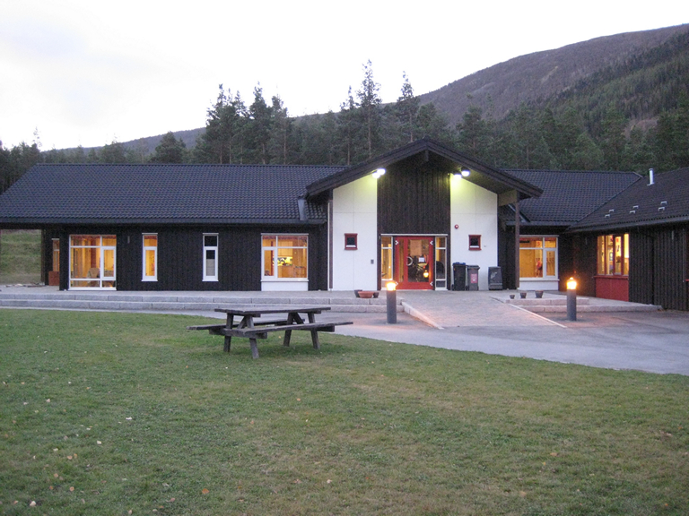
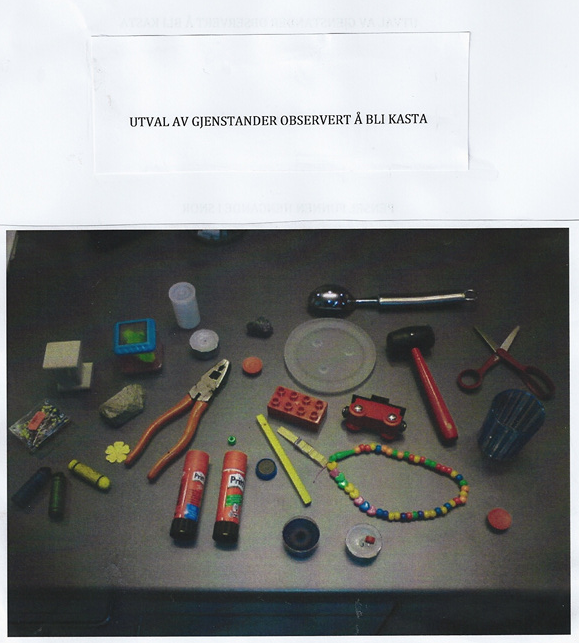
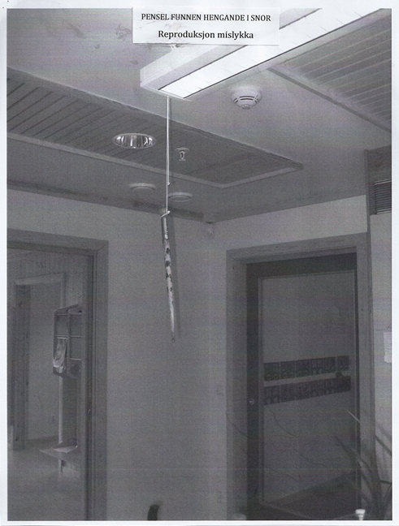
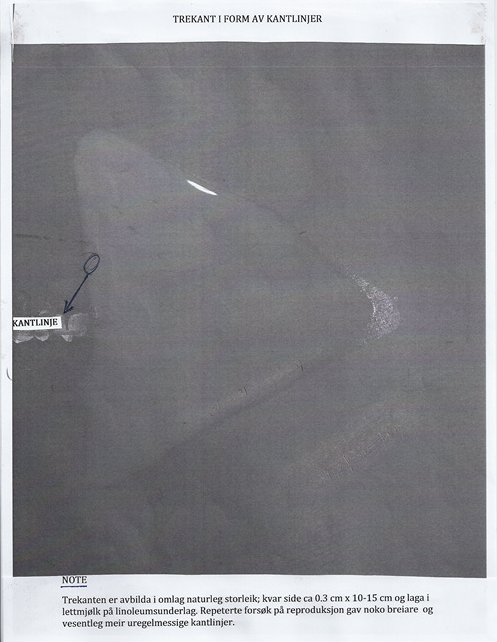
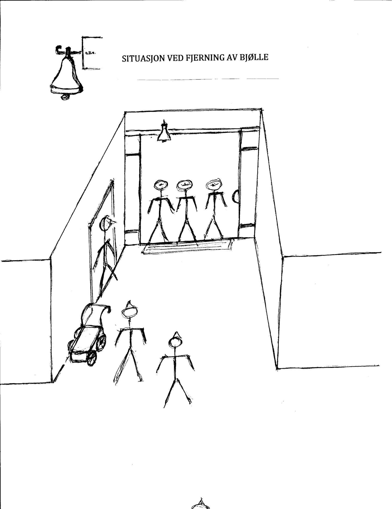

Author: Prof. Kjell Flekkøy  
Translator: Cia Severinsen  

**Introduction**

Lalm kindergarten was completed and presented as a modern kindergarten in October 2008, after the reconstruction of the previous kindergarten, placed in the same building from 1989. The relevant kindergarten (Department Kindergarten) is connected to and part of Lalm Upbringing Center. The school part of Lalm Upbringing Center was completed in 1970. Before this, there was no known use of the site. The layout is functional, light and airy; good in use. In the current period, the kindergarten had up to 30 children aged 1<sup>1/2</sup>-5 years and 15 employees (17-57 year); one man, the rest women.

The size of the building is 287 m<sup>2</sup> in a construction built on concrete. Its heating is provided by water running through pipe loops placed in the floor, with the top layer covered in linoleum (linseed oil, resin, and cork on hessian fabric). The walls on the kindergarten and personnel department are made of wood, or painted plasterboards. No high voltage cables are under or in the building. Waterways in the ground were not specifically examined and are not known. There are no high voltage lines, transformers or high-voltage cables within at least about 80 m. Distance to the nearest mobile transmitter (base station) is 1.5-2 km as the crow flies; to the nearest TV transmitter, over 10 km. In the attic is located a central fresh air system with a fan and electric motor. There are guides above the flat ceiling for fresh air and lighting. The technical department in the municipality has gone through the building without finding construction, technical, or other defects and deficiencies.

Image A. Picture of Lalm kindergarten. Photo by Rune Grindstuen.  
  

**Problem statement**

Employees of Lalm Upbringing Center, children and employees of Lalm Kindergarten, relatives to these people, representatives from Våga county and others registered a series of unknown and inexplicable happenings in Lalm Kindergarten and the connected personnel department during the period of 26th April to 15th June 2010. They, and the management department of Våga county, are interested in having the incidents registered, classified by content and form, and understood relative to scientific knowledge. The undersigned have been given a mandate to carry out the collection of relevant information and evaluate it for this purpose. Through this, phenomena of this type could in the long run also be made available for research.

**Note**

Acknowledgment: Many thanks to Vågå municipality and the staff at Lalm Upbringing Center for cooperation during the collection of the data material. Professor Eirik Grude Flekkøy, from the Department of Physics at the University of Oslo, is to be gracefully thanked for his contribution to the physics part of the discussion.

**Method**

The person responsible for the current report came into the picture immediately after the phenomena had ceased on June 15. Personal interviews from June 26 to mid-July were conducted with everyone centrally involved: the employees in Lalm Upbringing Center (5-6 people), two involved staff in the Church of Norway, two "clairvoyants" (including the one who was associated with the cessation of the events), a husband of one of the employees, and a male parent of one of the children. No children were interviewed and no names will be mentioned of the adults. Everyone among the kindergarten staff experienced incidents of the kind reported, but with variation in scope and content over persons and time. During the time of interviews and the period after, until September, a number of conversations and meetings have been held with individuals, groups of employees, and representatives from Våga county's management. Information provided by most of the individuals was controlled against the accounts of others present in the same situation. Where interviewers are unsure whether a piece of information is correctly understood in detail, doubts are clarified through new contact with the person or persons in question. Key events, referenced below, are all taken first-hand from those who experienced them. Significantly, almost all incidents have been observed by at least two people; often in groups of three and up to 20 people.

There was also a meeting with the staff to discuss a first draft of the report. And lastly, the final report has been assured for correct reporting and understanding of the information thought its having been reviewed by the manager for the kindergarten and Lalm Upbringing Center.

The report is also based on photographic material with written reporting of over 90 observations by the kindergarten manager, recorded during the activity period and immediately after this. The accounts being recorded just after the incidents happened make the reports less affected by memory shift. The pictures were taken by the kindergarten staff along the way, and a small selection is presented below. An extensive review has been done of older and newer literature of relevance to the Lalm observations, and for a biological and physical understanding of the phenomena.

The one responsible for the current report is professor emeritus of Psychology at the University of Oslo and its associated hospital (Oslo Hospital) -- with a specialty in the field of neuropsychology (brain and behaviour relations). In addition to research, several years of clinical work has provided a basis for distinguishing between diagnoses and conditions of psychiatric, neurological, and age-related nature. He has no financial or formal ties to persons at Lalm Upbringing Center, Lalm Kindergarten, or Vågå municipality.

In the following, I'll discuss the basis for confidence in the data, even if this thematically belongs in the discussion section. The reason is this: the phenomena portrayed are so unusual and little understood that the reader will be reluctant to take them seriously, as is the case with this report. Therefore it is necessary to evaluate the basis for confidence in the data as a first step.

**Trust in the data material.** The data material in this incident is derived from observations by employees and the families of employees at Lalm kindergarten and school, Lalm Upbringing Center, and additionally by employees of the administration of Våga county. There are six alternative interpretations of these observations; a) children's games/shenanigans, b) lies, c) psychosis, d) delusion/mass suggestion, e) tricks and nonsense, f) the incidents are physically real. We will have a look at each alternative later on, but focus on the general first.

It is important to take a stance on these alternatives. The nature of the phenomena reported below tends to invite explaining away rather than being explained. "You can't believe in this sort of thing," and "this sort of" phenomenon usually means one that is not recognized as physically real and potentially accessible to understanding based on the standard model of knowledge. People are apt to forget that what is real can only be distinguished from what is not real after examination and clarification of the nature of the phenomenon. New phenomena must be met with relevant knowledge. If it is beyond the standard model of knowledge, one must, at the very least, seek to clarify the form and substance of this novelty, and the situations in which it arises. This information must be probed in relation to available, relevant knowledge. It is only possible to assess whether one can or should proceed after such probing. This must also apply to the Lalm observations in order to be able to have confidence in the observations as sources of knowledge. Any other approach is fundamentally unscientific and results in entrenching existing knowledge while dismissing new knowledge. Our history of knowledge condemns people who did not want to see mountain ranges on the moon in Galileo Galilei's telescope — such as representatives of the church in his day. Currently: We know that much still remains to be understood about the world in us and around us. Lalm phenomena belong among what is scientifically new and unknown.

One implication of this is that the observations must be referenced unselected and in great detail, where it is possible, else one would risk losing information. Only knowledge will help to distinguish the material from the immaterial. The premise is that we can trust the personal reports. Unfortunately, it never reached the point where these could be substantiated by technical observations.

**Children's games/shenanigans.** This is a kindergarten. What would one expect other than chaos? Children throw things. Yes, they do, but here there are many observations of incidents happening when the children were outside. Furthermore, it was quickly discovered that several of the incidents could not have been created by children. They are too practically difficult for them. The acts of the children were considered, especially in the beginning, and controlled for; then excluded (chalk was found in several places, with the children's hands and pockets checked immediately without any sign of chalk; plastic beads fell from under a table while all children and adults nearby had their hand placed on the table). Games/shenanigans cannot be the main explanation of the Lalm phenomena.

**Lies.** That everyone lied; they would have to, considering how many people are in agreement. Even if this were the case, what would their motive be, and why now -- not earlier or later? The situation had a negative influence on everyone involved. They thought through making their story accessible to the public several times. They would have had to be motivated to lie, as well as the relatives who visited the building and experienced the phenomena themselves. The representatives of the county who reported incidents of the same nature would also have had to participate in the lie. Also those who, now and in the past, have written about similar incidents in other countries and cultures -- over long periods of time -- would be lying. This is not likely; in fact, so unlikely that we will not discuss it further. We may do the same with the next alternative.

**Psychosis.** Psychosis does not involve the movement of objects in front of many people. Objects require physical energy to be moved.

**Delusion/mass suggestion.** This is unlikely as well, since people quickly became 'threatened' when they themselves observed the incidents contrary to their expectations. Also, mass suggestion does not explain the movement of objects.

**Tricks and nonsense.** One or a few people could have brought about the first "performances". This was also the general interpretation in the beginning. However, it quickly became deemed as too unlikely by everyone; there were too many people watching each other. There were too many overlaps in the stories. Seemingly, it would have been impossible for one or a few people to go around throwing things around for 1-2 months without anybody noticing it. Additionally, incidents that could not have been caused by an individual happened from early on. Individual incidents as well as the totality of all incidents cannot be interpreted as a technical construction. The phenomena are too complicated, with the observations occurring simultaneously, independently of one another, over time by too many people with different, but similar interpretations. The kindergarten was also in full operation the entire time, with children and adults around each other. A motivation would be difficult to find here as well. In addition: One does not see a fixed pattern of person or persons connected to the phenomena; neither in form, contents, or scope, as one would have expected.

**The events in which several people were present were physically real.** This option appears is apparent as the most likely. Movement of objects in different situations over a period of time of 1<sup>1/2</sup> months in the presence of differently composed groups of persons, meets reasonable requirements of objectivity and trust that what has been reported has happened. `Associating phenomenon fell within the same category.`<u>Connected phenomena fall within the same category.</u> This applies to sound and movement patterns of objects, course of events (eg, removal of a bell that is immediately found), `experience of cold, discomfort and discomfort, skin affection, tremors and odor experiences. Also in these cases, several of the observers had expectations contrary to what was experienced. — Alternatively, one could argue that phenomena beyond proven changes of objects' position is "subjective", and therefore belongs in a "mental", "mental" value, affected by the person's uncontrolled processes with a lack of confidence in validity as follow`<u>experiencing cold, discomfort, skin affection, shivers and experiencing smells. These cases as well, have been observed by several people; what they experienced contradicted what they expected. Alternatively, one could claim that phenomena that does not include the position of objects are ‘subjective', and hence belong in a ‘mental', world; affected by the person's uncontrolled processes with missing faith in validity as a result.</u>. Claiming this can be done, but not without a certain burden of argument. `More persons simultaneously heard the sounds that occurred; more saw the quakes, more had skin impact and at the same time experience of discomfort and discomfort. The argumentative wanted also — barely with his good will — had to come to grips with the fundamental and relevant fact that all observations,`<u>Several people heard the sound that occurred at the same time; several people saw the shivering, several people experienced touches to the skin and at the same time a feeling of discomfort. The arguing would also, despite his lack of good- will, accept the fundamental and relevant fact that all observations,</u> including the installation of physical recording equipment and reading these, depends on what we call our subjective experience and our consciousness.

**Selection.** The events over the 1<sup>1/2</sup> months that they lasted are presented to a significant extent and detail, where such are available. Of individual events, there are far more than presented here (over 90). All kinds of events or phenomena are nevertheless dealt with to the best of our ability, either in the form of general discussion or through the presentation of the event or the events in a certain detail. `The greatest detail is also given to events that are visible most informative. This reflects a given circle of knowledge and can refine the presentation in an unfortunate way.`<u>Experiences that are seemingly most informative have been given most details. This reflects a certain theoretical framework, result in the tory being portrayed and in a bad manner.</u> Nevertheless, this kind of delimitation is hard to avoid for practical reasons. It is also positive and natural that one looks for causal understanding where such is cognizably possible. The events or phenomena that to a particular degree appear to be incomprehensible are nevertheless not kept out. `Judge is experience of "visions".`<u>Dreams are an experience of ‘hallucinations'.</u> This category will also include the cessation of phenomena which was connected to the "clairvoyant" presence in the kindergarten. `Omitting such events would express distrust of the observers and a confidence in current knowledge such as sufficient basis for exclusion we do not have scientific coverage for, given the form and content of the relevant observations.`<u>To leave out happenings like this will express distrust in the observations, and trust in present knowledge as sufficient basis for exclusion of what we do not have sufficient cover for; form and content aregiven by the relevant observations.</u>

**Concepts.** In the following, "throw" will be used to mean "movement of an object with the speed, direction and change of trajectory one usually sees when throwing" — an instance of literal throwing is not implied by this. "Supernatural" will not be used, because this term is about as meaningful as "subnatural". "Unknown" or "misunderstood" is better in this context. "Mental" is also not part of the vocabulary, because the mental factor is pervasive for all observations. The same goes for "Parapsychic". `In the more causal discussion at the end of the report, neither host "mental" or "psychic mechanisms" used to understand causation. This host done because the physical and direct sensory form of the observations involves one primarily physical form of understanding.`<u>In the more cause centred discussion in the last part of the report, "mental" or "physical mechanisms" were not used to understand connection between causes. This was done because the physical and direct sense driven form of the observations involve primarily a physical form of understanding.</u> Double parentheses (()) are used in direct quotations to display inserted remarks from the signatories' side.

**Result**

**Emergence and overall course of phenomena**

`One does not know of any changes in the staff group or other matters that are related in time to the emergence of phenomena.`<u>One does not know about the direct changes in the personnel group, or other relations that from time to time is connected to the development of the phenomena.</u> The events in question appear to have occurred abruptly on the 26th of April (below), although during the autumn of 2009 and early 2010, the staff points to two nonunderstood episodes: `Four to five ordinary balloons in different subjects were found inflated in the dock hook in the morning at two hooves, close to each other; unknown to children, staff and laundry assistant. The staff is sure that such large objects would have noticed warts until the evening before, had they been there.`<u>Four- five normal balloons in different colours were found inflated in the Doll corner in the morning, in two occasions, tightly placed; unknown to the children, personnel and cleaners. The personnel were confident that such big objects would have been noticed the night before, if they had been present.</u> After that, no new events appeared before the phenomenon debut.

`The first episode on April 26 seems to involve simple figures on doors ("half swastika"; about 30-40 cm long).`<u>The first incident, 26th April, seems to have been simple figures on doors ("half swastika"; approximately 30-40cm long).</u> Then came plastic beads, about 1 cm long, which fell down in the presence of children and adults. `Then came simple drawings of sack-shaped figures on doors; small figures made of feathers, paper flowers, etc. (see picture) with further development in the form of small objects that are observed coming into the air. The following host hit set from it written medical material as one of the first events: "Monday, April 26, 2010 sat NN and NN in the formation room on Goliath. Suddenly pearls sprinkled around them at the table. The were beads stored in a box with a screw cap, which stood high on a shelf on the warehouse of Goliath. "-" Pearls "as above.`<u>Afterwards, simple drawings of sack - shaped figures appeared on doors; small figures made by feathers, paper flowers, etc. (see picture) with development further to small objects being observed flying in the air. Following was sited from the written material as one of the first events: "Monday 26th April 2012, NN and NN sat in the art room at Goliat. Suddenly, beads started sprinkle around them at the table. This was beads that originally was stored in a box with a lid, standing on a tall shelf in the storage room at Goliat." "Beads" as over.</u>

Initially, the phenomena were limited to two or three of the staff; all in full health.

No distinct patterns emerged over time when it came to covariation between phenomena — shapes and frequency — and persons, rooms in the house, time of day, days of the week, or observer conditions otherwise inside or outside the house. In all rooms in the house, phenomena have emerged of one or more different kinds. There are three exceptions to the basic rule above. Throughout the time, 5-6 of the staff were more often in contact with phenomena than the others. `All hosts nevertheless perceived to have observed events over time.`<u>However, everyone had made observations over time.</u> The second exception: `Three of the staff were registered to have a dampening effect on the frequency and intensity of events — by presence in a room, it may not be anything`<u>Three of the personnel members was registered having a calming effect on the frequency of the happenings- with their presence in a room, nothing happened in many cases.</u>. The third is a development over time: `Gradually emerging events with greater intensity — stronger sound, more and heavier objects are thrown, subjective discomfort associated with the events becomes more pronounced.`<u>The incidents were gradually presented with more strength- stronger sound, more and heavier objects being thrown, subjective feeling of discomfort connected to the incidents became more noticeable.</u> This development seems to have persisted until `the events abruptly ceased after the gestation of a "clairvoyant"`<u>the incidents abruptly stopped after the visitation of a "clairvoyant".</u>. Along the way, a representative of the Church sought to influence the events through rituals. `By the review of the house in that context are sounds and events (throwing, doors that go att med brak) especially many and strong. Over the first couple of days then it is possible happen somewhat quieter, before the events turn eighteenth with greater force than before.`<u>With inspection of the house in this context, sounds and incidents (throwing, doors being closed with loud noise) especially frequent and strong. During the first days following, it may be somewhat more quiet, before the incidents come back even more powerful than before.</u>

`Syner. It is part of the context that employees who also worked in the elderly the kindergarten reports having experienced the presence and visual impression of a male person at a number of hay over a long period of time.`<u>Hallucinations. For more context; employees of the previous Kindergarten also reported experiencing presence and visual impression of a male person in numerous occasions over longer periods of time.</u>

**Forms of events**

1. `Movement of objects in the form of throwing, removal and return over time (in dei aller most cases); controlled movements, laying of patterns and other.`<u>Movement of objects in the form of them being thrown, removed and returned after some time (in most cases); controlled movements, making of patterns and more.</u> In most cases the objects appear to be coming out of thin air; sometimes from ceiling height. The starting point for such movements was seen in two cases: `a small light bulb used on a Christmas tree and a nonstop (see below)`<u>A small lightbulb used on a Christmas tree, and a non stop (see below).</u>. Movement in the form of throwing is the most common of all the events.

`The objects are made of wood, glass, plastic, metal, mineral, cloth, paper and combinations of materials (non-stop; mobile phone), and varying in size from small magnets, toy hammers, pearls, paper flowers and feathers for ordinary pliers and stones of smaller size.`<u>The objects have been made from tree, glass, plastic, metal, minerals, clothing, paper and combinations of materials (nonstop; mobile devices), and varying in size; everything from small magnets, toy hammers, beads, paper flowers and feathers, pilers and stones of smaller size.</u>

2. Influence of objects (controlled manipulation) — bottle that "dances", water in bottle at room temperature that bubbles when passing two people, new, unused program set on washing machine, `glass and doors that open (and resist closure) and goes att`<u>windows and doors being opened (and resistant when closing) are also repeating incidents.</u>, etc.

3. Direct contact between manipulated objects and persons, sometimes in a controlled manner (magnet that changes trajectory and strikes the shoulder, etc.).

4. Experience of strong, uncharacteristic discomfort; sometimes a sense of horror. With those who notice this best, the condition occurs in advance of throwing objects (`"now come it to happen something"`<u>(«Something is going to happen right now")</u>). The strong discomfort passes relatively quickly after the activity is ceased.

5. Feeling of heaviness in the head, sometimes headaches.

6. Strong feeling of cold, sometimes confined to parts of the body. Most likely the symptoms in points 5 and 6 are related to the same cause; `not interrelated`<u>however, direct correlation between each cause cannot be detected.</u>.

7. `Effect on skin on exposed areas - face, hands and arms.`<u>Impact of skin on exposed places- face, hands and arms.</u>

8. Odor experiences of an unpleasant nature (eg, vinegar, ammonia, "cat pee", the smell of rot), which are short-lived (minutes) and unexpected for the time and place, and with variation in odor experience over the persons present. `Not everyone needs to smell odor in it whole.`<u>However, not everyone present would be able to smell the odor</u>

9. `Sounds. Crackling and slight scraping, the locality of one room; loud noise in or near wall in a room (plural persons present); strong growling sound experienced in a third locality (one person).`<u>Noises. Crackling and weak scratching, localised in one room; strong sounds/ noise next door (several people present); strong growling sound in a third localisation (one person present).</u>

10. `Complex situations (laying patterns; locking play sheds; box with toys appears abruptly on the loft; bell removal; objects are lost only to be found in easily visible places that have previously searched; etc.).`<u>Complex situations (making of patterns; locking of toy box; sudden appearance of a box containing toys on the loft; removing of a bell; objects being removed and then reappearing in easily visible places which has already been searched, etc.)</u>

**Events**

**Movement of objects**

*Overall features*

a. Smaller objects suddenly appear without a sound 'like out of the air' at eye-height, eventually at ceiling height, hit the ground, always with a louder than usual sound, but with an otherwise normal character of sound. Where starting-points are located [it appears that] the movements have a very abrupt start with an 'explosive' character; the object whips away. Especially initially, the items concerned were mostly small and lightweight (a toy hammer, keys, blackboard magnets, etc.; see attached images); later also larger objects. `In the vast majority of cases host there is no recorded sound in advance, but see below. More people feel stronger discomfort (pressure in the head; feeling uncomfortable) seconds in advance; a person gets tremors in armane`<u>In most cases, sounds were not noticed beforehand, but look below. More people noticed stronger discomfort (pressure to the head; feeling of discomfort) seconds in advance; one person starting to shiver in the arms.</u>. The vast majority of objects can be found inside the kindergarten or just outside, but with some exceptions (old screw; old forged nails).

b. Another special feature is that the objects abruptly stop after the impact. The unexpected abrupt stop occurs regardless of the material of the object and substrate (metal; wood; plastic) and smooth or rough surface.

c. Breakable objects made of glass or ceramics do not smash into pieces as opposed to our usual experience with such items (cups, jars). When hitting the walls no marks are made despite what would be expected based on the item's weight, shape, speed and direction (e.g. a glue stick). On one specific occasion a jar of jam with a screw cap of metal was crushed to very small fragments after hitting the wall—but without leaving any mark on the wall. `In this case, the wall was off paint plaster; in the other cases plaster as well as wood.`<u>In this case, the wall was painted plaster; in the other cases both plaster and wood.</u>

d. About halfway through the overall course of events, employees notice thrown objects which, regardless of material, are heated; ie. slightly warmer than hand temperature. Objects are not hot in advance, and the heat passes after a few minutes.

e. `Individuals are considered by others to have a calming effect on the extent of phenomenon.`<u>Individuals were evaluated by the others to calm the effect of the scope of the phenomena.</u>

Image B. Selection of objects observed to be thrown  
  
Text in image:
```
SELECTION OF ITEMS OBSERVED TO BE THROWN
```
<u>A SELECTION OF OBJECTS OBSERVED BEING THROWN</u>

**Movements with sound at the starting point.** `It is hit from recording from one male relative of one of the employees — the only reporting of sound to the premises the starting point of the object`<u>It is cited from a male relative to one of the employees- the only report of sound localised at the base of the object:</u>: "Right after we [he and two others] had entered the eastern part of the kindergarten's living room, we heard a kind of snap from the ceiling. Then appeared a felt-tip pen of the sort we usually call a marker. It came at high speed from the ceiling and landed in a window facing south. The marker landed on the windowsill, and stopped as if had landed in glue. There it lay motionless. I picked it up and put it in my pocket..." — After about two minutes in the room, they hear again the same sound from the ceiling, and `a small light bulb lands in front of their feet (light bulb not used for lighting). Along with the light bulb lands a small stone (drawing pen-large).`<u>and a small loose bulb lands in front of their feet (loose bulb not used for lighting). Together with the loose bulb, a small rock (the size of a nail).</u> He picks up the objects, and feels that the light bulb is hot, "...as if it were recently turned off!!" In the same room, after a short time: The same sound is heard, and `a plastic cover lands with one some sliding motion along the floor`<u>a plastic cover landed with a certain slip movement along the floor.</u>. In the western part of the kindergarten: "In the same moment as we [he and the two others] entered this room, the sound came from the ceiling. Then there appeared a stone at head height that landed right before our feet. The stone had the size of the fist of a 3–4-year-old. The stone stopped right after it had landed. In the meantime another of the parents had arrived who also saw the event." (No comment was made about temperature.) Finally the same night: The same sound from the ceiling, and `a (playful) log appears from the roof that lands with abrupt stop`<u>seen by several people, a (toy) log appears from the ceiling, and lands with an abrupt stop.</u>.

`Interestingly enough, the concerned parent had initially been markedly critical of the veracity of the accounts of the personnel — as had most of the other men. This was rapidly and lastingly changed after the self-observation. Based on professional experience, he is a male doctor relatives also incomprehensible to the abrupt stop of the first object against slippery wooden surface in the glass frame. A female employee registered at a high "very short" one "shadow" / "eitkvart" about 2 m up. From there came immediately 10 small plastic beads, remains just under 1 cm in diameter and lands on the floor with "a violent bang". More is present.`<u>It should be mentioned that the relevant relative originally was strongly critical towards the realism of the personnel's observations- as most of the other males. This quickly changed, and lasted, after he got to observe himself. With background of carpentry, the male relative was also nonunderstanding of the first object's abrupt stop towards the smooth tree surface in the window frame. A female employee registered one occasion where, for a "very short" time, a "shadow" approximately 2m up in the air was present. Afterwards, 10 plastic beads immediately appeared, each approximately 1cm in diameter, and landed on the floor with a "violent bang". Several people are present.</u>

**Movements without sound.** There were one, maybe two exceptions to the loud sound reported on impact. `At one haystack, two employees go to the square outside the house and look through the glass, and observe a stone slip at high speed along the floor of the room inside.`<u>On one occasion, two employees are walking the area outside of the house and look through the window; they observe a rock with high speed along the floor in the room.</u> It comes from another room and `passes just past one of the other staff passing through the observed room, however which has not yet come to the area the stone seems to come from. This one reports not to have heard sound from the stone at all; nor to have seen it under speed (the person can probably be seen in another direction) — normal hearing; normal vision.`<u>pass straight past one of the other employees, who walk through the observed room, but still has not reached the area where the rock seems to come from. This person does not report having heard sounds coming from the rock at all; and neither having seen it moving (the person may have looked in another direction)- normal hearing, normal sight.</u> There were no sounds in or outside the house that could have masked sound from the stone; all children and adults were out of the house. The reconstruction immediately afterwards showed that the stone made a lot of noise passing along the floor as the two observers saw it did. `The sound should have been ours impossible not to right, it had slipped long floor surface as it looked. In another case; written material: "A toy car small in the floor of the shaping room on Goliath. Then it looked not like everyone heard the sound". — The stone is of a kind one finds outside the house.`<u>The sound ought to be impossible not to hear, if it had slid along the floor like it seemingly did. In another case; written material: "A toy car crashed into the floor in the art room at Goliat. It looked as though not everyone heard the sound". – the stone is the kind to be found outside of the house.</u>

`**Movements with observed starting point but without associated sound.** By two hooves are the starting point of the object seen. **Lightbulb.** In one case, another small light bulb used on a Christmas tree set to lift itself up from a small basket on a free-standing kitchen counter ("the island") and fall to the floor 1-2 m away with an unnaturally loud bang and striking zigzag movement on landing. No rotation or other special conditions registered in basically. The observer perceived the total movement as somewhat slow and controlled. The path towards the impact, but not the starting point, was observed by several of a group of 20 people present. **Non-stop.** In the second case, three of the staff sat at a small one table with muffins; the nearest about 3/4 m away. Under the full supervision of all host, one of two non-stop set abruptly to disappear from one of the cakes and land with a loud bang immediately attmed. Several small magnets land immediately afterwards with a loud bang on the floor nearby. The was no mark in the melis layer beyond the imprint from the distant non-stop. In a third case is in all hove basically delimited. Children sit around the table; plastic beads fell against the floor — and kept doing so, coming from under the table after the children had laid down their hands on the table top.—`<u>Movement with observed base, but without connected sound. The base is observed by two people. Lightbulb. In one case, a small lightbulb for Christmas tree was seen lifting itself from a basket standing on a kitchen island and fell to the floor 1- 2 meters with an unnatural loud sound, and apparently zigzag movement when it landed. No rotation or other significant conditions registered originally. The observer interpreted the total movement as something slow and uncontrolled. The path towards the landing, but not the origin, was observed by several people in a group consisting of 20 people who were present. Non- stop. In the other case, three of the personnel are sitting by a small wooden table with cupcakes; the closest one approximately 1m away. While everyone was watching closely, one out of two non- stops were seen abruptly disappearing from one of the cupcakes, and landing with a bang nearby. Several small magnets landed on the floor with a loud bang nearby right after. There were no marks in the frosting besides the mark from the removed non- stop. In a third case, the base position of all incidents are limited to one area. Children sat around the table; plastic beads fell towards the floor- and continued to do so, from underneath the table after the children had put their hands on top of the table.</u>

**Rounding of corners.** `With several hoes, objects are transported from one room to another anna - also rooms (warehouse, eg) with locked doors and windows - and with strongly deflected paths along the way. One cup more people saw and knew was probably to be found immediately in advance in one adjoining rooms come through an open door and strike against the ground in a new room after apparently to wart transport around the corner the door represents in relation to the starting point (removal of the object from the starting point was not observed). In another case, the incident implies that the movement starts on a wall shelf in the corridor, assumes wall, along the corridor a few meters, and into the wall again - a movement with more bends of the path.`<u>On several occasions, objects have been transported from one room to another (storage room, etc.) with locked doors and windows- and with winding paths along the way. A cup, which sever people knew where was located, came through an open door around the corner that the door represents in relation to the base point (removal of the object from the base point was not observed), and struck against the floor in the next room. In another incident, the happenings implies that the movement started on a wall shelf in a corridor, goes out from a wall, move across the corridor for several meters, and inn through a wall again- a movement with several windings to the path.</u>

**Direct contact.** In one case, a small whiteboard magnet is seen by two coming towards the person, and at the last minute change course and strike against one's shoulder.
— During a meeting with many present, an employee asks to be allowed to change places: `she experienced receiving, several times, a finger to the neck`<u>This person experienced a finger touching her neck on several occasions.</u>. Others see a red mark there. The phenomenon ceases when changing seats.
— Two of the employees are in the warehouse. On the wall hangs a large ball. `Both stand bent over and search.`<u>Both was bent over, searching.</u> They suddenly notice a movement in the peripheral field of view, and both experience immediately afterward getting a strong pressure in the back, of what they think is the ball. They would have fallen, had the room been a little bigger. The ball is seen hanging as before when they turn.
— Two employees and their partners (four people) leave the kindergarten in the evening after a meeting. `In advance it had been ours great activity with throwing and loud noises inside the house.`<u>Previously, there had been large activity with throwing and loud sounds inside the house.</u> As they walk along the house wall, they hear and see gravel and pebbles land against the wall from the outside. `They open and close a small frame; talking together, two people hear squeaks from the gate (familiar sound), and less stone lands against the back of one of the women. This person is facing the gate, dei three others to varying degrees against it. Nobody sees a coma. The estimate is not particularly hard, but host experience as without any cushioning other than of intermediate cloth.`<u>They opened and closed a small gate; while talking together, two people heard a squeak from the gate (known sound), and smaller rocks landed on the back of one of the women. This person was facing away from the gate, while the other three were facing it to varying degrees. Nobody noticed anything coming. The hit was not significantly hard but was interpreted as only weakened by the clothes in between.</u> This is of interest in terms of the mechanisms underlying the movement of the stone. `Immediately after the right sound of gravel they perceive the host throwing at one of the cars. Ålment: No children are known to be physically affected by objects.`<u>Immediately after, a sound of gravel which they interpret as being thrown towards one of the cars is heard. Generally: no kids are known for being physically affected by objects.</u>

**Position effect.** `In one case, two people had a location in the kitchen at Lalm Upbringing center (not Kindergarten Department) effect on throwing objects. The one of these work at Lalm Upbringing Center, the other at Avdeling Barnehagen.`<u>In one incident; two people's placement in the kitchen in Department Upbringing Center (not Department Kindergarten) had an effect of the throwing of objects. One of these works at Lalm Upbringing Centre, the other at Department Kindergarten.</u> With a starting point in a delimited area about in the middle of the room — estimated at about one meter in diameter — `was the movement of the body by a few centimeters (about 10 cm worth it) towards one side of the room immediately followed by objects that appeared at eye level right of the person, passed and landed with sudden stop and loud bang in a limited area further ahead. The objects were, among others, a dispenser key, forged nails, a small metal ball, a used, old screw`<u>Movement of the body with only a few centimetres (approximately 10 cm, supposedly) towards one side of the room was immediately followed by objects appearing at eye height to the person's right, passing and landing with an abrupt stop and loud bang in a limited area further ahead. The objects were for example a dispenser key, forged nail, a small bullet made from metal, an used, old screw</u> — the forged nail was not known from the nursery; the metal ball was otherwise placed in a locked room on the other side of the corridor. Further details: `The kitchen was in use this afternoon for the end of the summer; that is, the one of two halves were there — divided by a half-wall protruding into the room along a center line. The "impact area" was in-line away from this half wall. Moving towards the activity part of the kitchen was related to throwing; movement backwards and or towards it the other side seems to be without such an effect.`<u>The kitchen was used for a graduation party this evening; meaning, one out of two parts, divided by a wooden wall sticking out into the room as kind of a middle line. The "Affected area" was a line going away from this half wall. Movement towards the activity part of the kitchen was connected to throwing; movement backwards and/ or against the other side was seemingly without this effect. </u> The position effect was accidentally discovered by one person. `This asked for "replacement" with the same effect registered for the next person. Six more eight people came and went in the room during the approximately 30 minutes the events lasted, and a majority of these observe the phenomenon.`<u>This person asked for replacement, with the same effect registered for the next person. Six to eight people came and went during the approximately 30 incidents, and the majority of these observed the phenomena.</u>

`**Transient change in drug properties**`<u>Passing change of material characteristics</u>

Two jackets belonging to the same owner were found, `erected along the wall (wooden wall; the jackets in thin and soft material - polyester and nylon). Only "a few inches of sleeves and down jacket lay out along the floor used by her in work out immediately after". One host hung up that by owner — the other [...]. Upon entry, this one finds the att-hanging jacket standing up along the wall as before. Hanging on top of the slippery clothes host found her mobile phone with the display facing the fabric. No fastener between phone and jacket; no attachments or connections one could see or notice between the wall and this.`<u>Raised up against a wall (wooden wall; jackets in thin and softmaterial- polyester and nylon). Only "a few centimetre of the armes and bottom line of the jackets were laying on the floor". One of them were hanged back up by the owner- the other used by her in work right after. When the person arrived, the jacket staying back was standing up against the wall like before. Hanging outside of the smooth clothing, her phone was found with the display against the fabric. No attachment points between the phone and jacket; no attachment or connection visible or noticeable between the wall and jacket.</u> This also applied to the other of the two jackets that were first found. Thorough interrogation give no indication of feeling of resistance to removal of phone or jackets from wall. For example, the phone seemed to hang loosely on the outside of the jacket when removed. `No glue fabric was noticed; no marks on the jacket. But "the display was dirty as if someone had no effort was made to get the phone to attach to the jacket again; nor equivalent for wall jackets.`<u>No glue was noticed; there were no marks on the jacket. However, "the display was dirty, like if someone had licked it". No attempts of re- attaching the phone to the jacked were made; neither for the jacket and wall.</u> No noises or extra heat were registered associated with the phenomena. `The cell phone had been gone five hours earlier that day.`<u>The phone had been gone for five hours earlier this day.</u> Attempt at reconstruction showed that it was impossible to recreate the positions of the jackets and the phone, given the smooth wall surface and smooth, soft fabric; a smooth surface against smooth fabric. Two people observed the jacket and telephone line-up.

`At another hay a smooth and clean piece of wood, about 10 x 1 cm, was observed to land with one big bang against a bubble jacket in nylon fabric — one of his children — and get hung up on one plain and clean surface of the fabric. Two to three people observed this. No heat attached the objects; no resistance to removal. —A sandal to one of the children was found hanging on a children's jacket in the wardrobe. No resistance to removal; smooth, pure surfaces against each other also here.`<u>With another person, a smooth and clean piece of wood, approximately 10 x 1 cm, was observed landing with a big bang against a jacket in nylon fabric- one of the children's- and stay hanging on a clear and clean area of the fabric. Two- three persons observed this. No heat was connected to the objects; no resistance when removing it. – A sandal belonging to one of the kids were found hanging on a children's jacket in the wardrobe. Not resistance when removing it; smooth, clean surface against each other here as well.</u>

**Local influence**

`**"Dancing bottle" and other.**`<u>"Dancing flask" and more.</u> A plastic bottle half full of cleaning alcohol started abruptly rotating around its own axis, `quickly and with large strokes without falling down. It is hit from observer's report`<u>rotating in place with rapid movement, without falling to the ground. As cited from the observer's report:</u>: "I was the only one who saw that bottle on the kitchen island. `I came from fine-wardrobe (Goliat)`<u>I came in from the wardrobe (Goliat),</u>, and rounded the corner to the kitchen. `The nearest adults were away in the great room (Goliath)`<u>The closest adults were located at the far end of the ‘big- room' (Goliat).</u>, ie 8-10 meters away. All the children were out. There were no bubbles in the bottle. `It stood completely on the edge (corner), spinning around its own axis. It should not really continue to spin, it should actually fall to the floor. I was like that grabbed it and stopped spinning after a few seconds.`<u>It stood right on the edge (the corner), and spun around its own axis. It was not really supposed to continue spinning; it was supposed to fall to the floor. I reached for it, and it finally stopped spinning after a few seconds.</u> The bottle contained alcohol, for washing hands with. `It's just an incident where the bottle spun." The island is a free-standing bench in the kitchen.`<u>Only one case where the bottle spun happened." The island is a bench placed in the middle of the kitchen.</u>

`In another case, a brass candlestick went over the end with a strikingly strong bang in it the two pass by at a good distance from the bench on which it stood.— Doors offer unexpected resistance to closure, marked but transient (minutes); door goes that with violent crash — in all cases in the absence of air draft and person.`<u>In another case, a brass candlestick fell over with a following loud bang when two people walked by, with good distance to the bench it stood on. – Doors made unexpected resistance when being closed, significant but passing (minutes); a door is shut with violent noice- in all cases in the absence of air draft and people.</u>

**Bottle bubbling.** A plastic bottle with water at room temperature stands still on a shelf in the kitchen. Two employees (including the one who saw the "dancing bottle") `pass by on cards distance - meters; part of the meter - and registers that there are abruptly rising bubbles in the lake`<u>Passed with short distance, maybe only a meter, or less- also registered abruptly creation of bubbles in the water.</u>. This was not the case before passing, and the bubbles ceased immediately after passing. `Dei did not examine the temperature`<u>They did not examine the temperature</u> in the water or in the bottle.

**Brush on string** `A majority of people suddenly find a small paintbrush hanging from a thin, smooth cotton cord, fastened to a light fixture in one of the rooms (see picture). It becomes a sign down, but shortly after being found in the same position. Several are trying to fix it as it was the find was unsuccessful (smooth thread; soft attachment for the thread in the brush).`<u>Several people suddenly found a small paintbrush hanging from a thin, smooth cotton wire, connected to a light fi xture in one of the rooms. (see picture). It was taken down but found hanging in the same position shortly after. Several trials of attaching it like it was found failed (too smooth wire; soft attachment point for the wire in the paintbrush).</u> The suspension can bring to memory the phenomenon with the mobile phone on the jacket, and similar events mentioned above.

Image C. `Brush on string`<u>C. Brush in a cord</u>  
  
Text in image:
```
BRUSH FOUND HANGING IN STRING

Reproduction failed
```
<u>Brush found hanging from a cord

The reproduction failed</u>

**Electronic and electrical phenomena**

`Three cell phone calls in the hours the owner could not find it (not it same as mentioned above); three images from one day's exposures of moving objects were the day afterwards not to be found on the electronic camera. One does not know where the fault lies — during storage, preservation along the way, or during retrieval. A movement indicator located in the corridor in the nursery (visible light) was activated after closing time. It is conceivable that person(s) may be the cause. During the closing of the kindergarten at night, when everyone had gone, the light in one of the rooms was turned on twice after switching off. One person observed this. The observation is trusted by other employees and signatories.`<u>Three calls were made to the phone during the time the owner was not able to find it (not the same one as mentioned above); three pictures capturing moving objects were not to be found in the electronic camera the day after. One does not know where the mistake originates- from saving, during storage, preservation along the way, or during retrieval. An activation of a motion indicator, after the Kindergarten had closed for the day, located in a hall in the Kindergarten (visible light). It is possible that individual(s) could be the cause. During the closing of the Kindergarten at night, after everyone has left, a light in one room was turned on twice after the Kindergarten had been closed. One person observed this. Other employees and the signatory believe in these observations.</u>

**Effect on persons**

**Headache; feeling of pressure.** `From early on and during the process, they were employees variation over persons plagued by feeling of pressure / heaviness to the head; often also headaches.`<u>From early on, and during the period of the incidents, the employees, with varying individuals, were bothered by pressure- / feeling of heaviness to their head; often headaches as well.</u> This effect was worst on the days with the greatest activity, and `worst for the one or the most involved. For people with a history of headaches from before, one notices that the symptoms now vision coincides with the former, but amplifies.`<u>worst for the person, or people, who were most involved. People with a history of headaches noticed that the symptoms were still similar to those before, but stronger.</u> Headaches and heaviness of the head is by far the most common of the subjective ailments.

**Feeling uneasy; strong discomfort.** `These were also common experiences with variety and affiliations as above. The feeling of discomfort is very uncomfortable and does not seem to matter coinciding with other experiences of a similar kind the person may have had. Eit characteristic example are the exercises of the persons who, together with the representative of the church, went through the house for the purpose of curbing or removing the phenomena.`<u>These were also common experiences, with variety and connections like above. The feeling of discomfort was highly unpleasant and appeared not to be coincidental to other experiences of equivalent nature that the person must have had. A characteristic point is the experiences with the people who together with the representative from the Church inspected the house, with the purpose of easing or removing the phenomena.</u> In this case the feeling of horror was strongest in the vicinity of a large, electric motor for the fresh-air system in the attic. `Not least, the representative from Kyrkja experienced strong horror in this city.`<u>Especially, the representative from the Church experiences a strong feeling of discomfort in this place.</u> It is conceivable that there may be a causal connection — if unknown — between the form of the experience and the physical force fields that the electric motor generates.

**Cold.** Several persons experienced the sudden onset of strong, uncharacteristic cold; regardless of location in relation to natural drafts and cold sources. The phenomenon occurred regardless of the room temperature, and `was limited to one of many people stades in space`<u>was limited to one of many people present in the room;</u>; sometimes also to part of the person's body. `In one case was also marked heat experienced below normal room temperature, limited to one person. Feeling cold could also occur in some immediately before object throwing`<u>On one occasion, noticeable heat was experienced when the temperature was normal, limited to one person. Sense of cold (12) could also arise with some people leading up to objects being thrown.</u> (the two most involved initially). The prevalence of perceived cold in the room was not investigated.

**Advance notice.** `"Now something is going to happen" — an experience that seems to be able to be limited to the mental, but usually combined with a bodily experience feeling of discomfort or discomfort; also cold-feeling.`<u>"something is going to happen right now"- an experience appearing to be limited to the mental, but most often was combined with bodily felt discomfort; and additionally a feeling of cold.</u>

**Ventilation in the room.** `Sensation of local airflow; aeration. The phenomenon seems to take shape strong local, physical movement of air`<u>Feeling of local air flow; aeration. The phenomena seem to have a form of strong local, physical movement of air.</u> (local movement of light objects is recorded in the literature).

**Smell.** Unpleasant smells were for a long time `registered by a majority of people unexpectedly`<u>registered by several people in unexpected</u>, and in various places contrary to rational understanding — `abruptly arising, lasting seconds to minute; not always experienced with the same quality by everyone present, sometimes absent at one between several people (sulfur, vinegar, salmiakk, cat pee, rot smell)`<u>abruptly appearing, lasting from seconds to minutes; not always experiences in the same quality by everyone present, sometimes missing with one or more people (sulphur, vinegar, ammonium chloride, cat pee, rotten smell).</u>. The experience was not related to any of the other phenomena. A person knew the same smell `in the same place several høve`<u>in the same place on several occasions.</u>.

**Sound.** `In one of the rooms on Goliath was over time by several hooves of children as adults heard unidentified sounds such as bangs (including other rooms), crackling, slight scratching and beeping.`<u>In one of the rooms at Goliat, on several occasions, children and adults head unidentifiable sounds such as bangs (in other rooms as well), crackling, weak scratching and squeaking.</u>

`**Skin affection.**`<u>n/a</u> About halfway through the course, strong redness occurred, "as with strong sunburn", in the face and exposed parts of the hands and arms of two employees. `One of these were between the two most involved to begin with. The phenomenon occurred regularly in the further course`<u>One of these was between the two most involved in the beginning. The phenomena occurred regularly further on in the course, and varied in strength</u> and covaried with the force and frequencies of object movements and the strength of the associated sound. `Along with the strong affection of skin, the eyes also appeared unnaturally shiny in the most affected. Skin and eye affection occurred after a few minutes of physical activity in the room, lasting several hours after finishing the working day, and was to the great discomfort of her and the other affected`<u>Together with the strong affection of skin, the eyes also appeared as unnaturally teary with the most affected. The skin- and eye affection arose after a few minutes of physical activity in the room, lasted for a few hours after the work day had finished, and created huge discomfort with her and the other person affected.</u>. Redness and the eye affection were observed by many.

**Tremors.** In the most affected of the persons above, there also occurred strongly unpleasant, uncontrollable, powerful and symmetrical tremors of the arms. This could occur seconds ahead of the movement of objects as well as along the way, and was widely observed. The tremors seem to have covaried with the frequency and strength of object throwing in the room.

`**Visual experiences. Syner**`<u>Visual experiences. Visions.</u>

`"Visions" of woman and man in full figure, one seen blurred from the side, were observed by two of the employees during the course period. The visual experiences appeared unclear; in one case as a silhouette.`<u>"Visions" of a woman and man in their whole figure, one of them seen unclearly from the side, was observed by two of the employees during the period of the incidents. The visual experiences were interpreted as unclear; in one case only as a silhouette.</u>

**Complex events**

`**Disappearance — invention.**`<u>Disappearing- reappearing.</u> Over time, many objects were lost; `after thoroughly looking, they were then found easily visible — the cell phone on jacket is an example. Consistent is the city of discovery investigated earlier.`<u>thoroughly searched for, and then being found easily visible to the eye- the phone on the jacket is one incident. The place where it was found has been examined earlier.</u> The items are small — keys, children's clothing. Several of the times the object was found wrapped in other garments or placed in other unexpected places around the nursery. `After the cessation of events, good luck objects appear with coma to be corrected.`<u>After the incidents stopped, objects continued to be found.</u> Children were suspected to begin with, but new examples made this almost unthinkable. `Causal clarification here is of course separate demanding.`<u>Determining the cause in this case is of course especially difficult.</u>

**Pattern making.** Patterns were made of different materials in the form of eg. `triangle, cross, and simple compilations of simple objects. The first sentence is probably (a) a simple 30-40 cm long line with end hooks — perceived as part of a swastika — slanted and set with chalk on two doors, (b) sack-shaped figure deposited with chalk on the door. Several gongs were made into a triangle on the floor, which in a quarter of the cases pointed mainly towards one room (the kitchen in the old kindergarten).`<u>triangle, cross, and simple compilations of simple objects. The first incident was believably a) a simple 30-40 cm long line with hooks on the end- interpreted as part of a swastika- slanted and made by chalk on two doors, b) sack- shaped figures made by chalk on doors. Several times, a triangle was made on the floor, which mainly pointed to one room (the kitchen of the old Kindergarten).</u> In one instance the triangle was made of skimmed milk on a painted wooden table (see picture), in a well-controlled situation: `persons had left the room, control of door, came immediately after that and found the figure. The pattern was made with small and light objects (eg, springs, paper flowers).`<u>People had left the room, having the door still  in view, then came back immediately and found the figure. The patterns were made with small and light objects (e.g., feathers, paper flowers).</u>

Image D. Picture of pattern  
  
Text in image:
```
TRIANGLE IN THE FORM OF BORDERS

BORDER

NOTE
The triangle is depicted in approximately natural size; each side approx. 0.3 cm x 10-15 cm and made in light milk on linoleum underlay. Repeated attempts at reproduction gave somewhat broader and significantly more irregular borders.
```
<u>Triangle found in the form of borders

The triangle is depictured as natural sized; each side approximately 0.3 cm x 10- 15 cm and mainly made with milk on a linoleum surface. Repeated attempts to repeat the incident gave some wider, and significantly more irregular borders.</u>

**Sounds associated with heavier objects.** `A box full of toys host placed with a loud bang on the floor of the loft — it had not stood there before. In the WC you can hear a loud bang about a toy box that stood where it was lifted up and looked down sharply at that. One employee was present in the room, but does not see movement of the cash register.`<u>a basket full of toys were placed, wth a loud bang, on the floor of the loft- it had not been there before. On the toilet, an employee heard a loud bang, as if a toy box were lifted and put down with force. Another employee was present in the room but did not observe movement of the box.</u>

**Door locking.** `Play sheds on the square outside the house are locked while one of the employees stands with the relevant key in his pocket a few meters away, with the house and door in full view — discovered by the one who cleans in plays abruptly finds the door locked contrary to expectation and the situation minutes in advance.`<u>when one of the employees, who stood a few meters away with the key for the play shed in their pocket- able to see both the house and the door, the employee that was cleaning up the toys abruptly found the toy box to be locked, which contradicted both their expectation and the situation just minutes before.</u> The spare key was kept in the principal's office — locked. Whether the reserve key was there at the relevant time was not investigated. —`All the doors to three toilets inside the kindergarten turn out to be mechanically locked in a situation where use should to say that they were open.`<u>All of the doors leading to three toilets inside the Kindergarten were mechanically locked in a situation where they were supposed to be open.</u> The employee had to use a screwdriver to open the doors.

`**Mechanical movement of crane, and other.** The tap for water in the kitchen host was turned to hot several times, despite being in the "cold position" immediately in advance, and a person being present while this happened (movement of the crane was unobserved). Opening of a window in the kitchen four times after closing immediately in advance — without the presence of a person (the movement not set). Doors meet resistance to closing, or can be made with very loud noise, without personal attachment or pull through the room.`<u>Mechanical movement of a tap, and more. The tap for water in the kitchen turned to hot water several times, despite being placed in "cold position" immediately previous, one person was present when this happened (movement of the tap was not observed). A window in the kitchen was opened several times right after the Kindergarten had closed for the day- with no people present (the movement was not seen). Doors give resistance when being closed, or are closed with a loud sound without being connected to any people or air low through the room.</u>

**Removal and retrieval of bells.** The event came relatively early in the course — May 5th. A total of six people are gathered in the room — `the cloakroom and the exit area in the kindergarten`<u>the cloakroom and exit area [in the kindergarten]</u>. A seventh person, a male teacher, `is near the door in a noisy room (see sketch). The exit area is about 3.5 x 3.5 m in front, larger further back; with a large glass door in front and doors that go off in three directions at the rear edge. Above the glass door / exit door is mounted a small bell (sheep bell) that strikes the door when it opens to alert with a sound by the piston striking the material of the watch. Just by the exit door and to the left as seen from the inside is a door to the toilet. Just inwards from this door, all the way to the wall, stands a smaller wheelbarrow for children. The handle is facing the door; the seat part is covered by a little wool. Right next to the carriage on the right side is a teacher at Lalm Upbringing Center; like to the right of this and a little behind is an employee in the kindergarten. With your back to the toilet and the spirit and attention facing the area between the exit door and the latter two stand a third. With his back to the front door and his face and attention mainly turned inwards, there are three other employees in the kindergarten.`<u>[missed text at start] the... exit area is approximately 3.5 x 3.5 x m ahead, bigger further to the back; with a big glass door in the front and doors leading to three different directions in the back. Over the glass door/exit door, a bell that hits the door to make a sound when it is opened is installed (sheep bell). Right beside the door, left to it seen from inside, there is a door to the toilet. Straight inside of this door, by the wall, stands a smaller trolley for children. The handle is directed against the door; the seat part is covered by a small sheep wool. Beside the trolley, on the right side, a teacher from Lalm Upbringing Centre stood; to her right and a little behind, an employee of the Kindergarten stood. The two last people present were standing with their back against the toilet, with their face and focus mainly directed towards the area between the exit door and the two people previously mentioned, and between them a third person stood. The other employees stood with their back to the exit door; face and attention mainly focused inwards.</u>

Image E. The situation when removing the bell  
  
Text in image:
```
SITUATION WHEN REMOVING BELL
```
<u>Incident of removal of bell</u>

It's afternoon, people are about to go stand and talk together. `Suddenly one strikes key with pendant in the glass door (exit door) from the inside and lands with a big bang against the carving below. It is registered at eye level by the person closest to the pram by passing outwards on her right side. A few seconds later, the people hear the front door and otherwise in the room a sound from the bell - the piston against the goods — the person by the carriage as short and muffled, the people at the WC and front door hear the sound clearly. The one of these the sound was clearly heard "... and wait to get the bell in your head".`<u>Abruptly, a key hit the glass door (exit door) from the inside and landed with a loud bang against the lattice below. It was registered on eye- height by the person closest to the trolley, by passing her on her right side. A few seconds later, the people standing by the exit door and the other people present in the room, heard a sound from the bell- piston against the goods- the person by the trolley heard it as short and muffled, while the people by the bathroom heard it load and clearly. "… and expected the bell to fall to our heads".</u> The people inside the room look at the bell, the people at the door look up — and the bell is gone. `The bell had wart seen the minutes in advance. It is somewhat unclear whether everyone is equally aware of the sound. No one has moved; no one moves. Person number seven in the other room has below this potential insight into the entrance area (not clarified where he is at any given time). The person by the pram follows "an impulse", as she expresses herself, bends down, puts her hand under the skin — and finds the bell there, down in the carriage (no special heat registered with the object). A few seconds have passed — maybe up to 10 sec. from the key slammed against the door and some from seconds at most since the squeeze was heard from the bell.`<u>The bell had been watched during the minutes leading to the incident. it is somewhat unclear whether everyone present heard the sound equally clearly. Nobody had moved; nobody did move. Person number seven in the other room had potential view into the entrance area (not clear where he was at all times). The person by the trolley followed "an impulse", as she expressed herself; bent down, stretched her hand out under the sheep skin- and found the bell there, in the trolley (no significant heat of the object was registered). Only a few seconds had passed- maybe almost 10 seconds from the key hit the floor to a few seconds (at most) since the bell made noise.</u> The person who found the bell cannot explain in more detail what made her act as she did. `One notices that more people use the term "indulgence" as part of the experience of finding objects.`<u>It is noticed that several people use the word ‘impulse' as part of their experience when finding objects.</u>

*Clarification.* `Everyone present has the interview left to them by the signatories. It is full coincidence between the reports from the individuals.`<u>Everyone present was interviewed separately by the undersigned. The reports perfectly fit one another.</u> The events came as a complete surprise to everyone. `It is inconceivable that a "quarter" — person or technical installation — could have operated in the short periods of time that are relevant, within such a limited area and within a field of vision that is essentially covered by six people at the same time. A notary that the attention of several persons was directed at the bell by the sound from it, and all these register that it is no longer there — but immediately after the host is found. The bell and the sound from it had the wart registered (as inconspicuous) immediately in advance of the actual event by passage of persons through the door. It is therefore very likely that it had ours which immediately precedes or coincides with the time of the short squeeze. The also means that the bell is fastened with a bent hook, so that one must lay the bell horizontal before lifting it up and away from the hook. Reconstruction by the undersigned showed`<u>It is unthinkable that "anyone"- person or technology- could have operated in the short time periods of significance within such a limited area, and within sight of essentially six other people at the same time. It is noted that the attention of several people was directed towards the bell and sound it made, and they all registered that it was no longer there- but was found moments later. The bell and sound from it was registered (as inconspicuous) immediately before the relevant incident of people walking through the door. Therefore, it is highly likely that it had been there immediately before, or during the time of the short sound. Additionally, the bell was attached by a crooked hook, so it had to be laid horizontally before lifting it up and removing it from the hook. The attempt of reenacting this scenario by the author showed</u> that the chain of action could be carried out without problem — `except for a somewhat high single sound from the bell`<u>except from a somewhat loud sound from the bell</u> during removal and a very visible cause. In the present case, `the control is people in between and with the space between them and around them very good. The most nearby explanation — all lies — does not appear to be the most appropriate alternative causes discussed earlier. One can claim that the key to the route and squeezed in the bell is a classic magic trick to divert attention from the central event — removal of the bell.`<u>the control of the people, the room in the middle of them and around them is fairly good. The most logical explanation- everyone is lying- does not appear to be the most relevant alternative, based on reasons previously discussed. One could claim that a key against the window and sound from a bell are classical magic tricks to divert the attention of the central incident- removal of the bell.</u> The problem with the hypothesis in this case is that the localized sounds focus attention, they do not distract it. The central field of view is always covered by several people. It was not investigated whether the bell found in the carriage was identical to the bell above the door — no one thought about it. In any case, the invisible removal of the bell must be explained.

`**"Materialization" box with toys.** Box with toys appears abruptly on the loft in several views — it had not been there in advance; loud sound like when box is seen against floor.`<u>"Materializing"- a box with toys. A box containing toys abruptly appears on the loft, visible to several people- it had not been there before; loud sound, like when a box is put down to the floor.</u>

**Cessation of phenomena**

The events ended on June 15. `In the time since, missing objects have gradually come to be corrected. Apart from this, no new incidents are registered at the end of October 2010.`<u>In the following time, missing objects has gradually reappeared. Exceeding this, new incidents have not been recorded after it all ended in October 2010.</u>

On the day in question, a "clairvoyant" was present in the kindergarten and performed a ritual in the presence of several of the staff. `As it was conveyed, the ritual took the form of a "clairvoyant" detection of "forces". Since there is a public connection between the "clairvoyant's" presence and the cessation of events, two inputs and one have been completed follow-up conversation with the same. These confirm an experience in this of "contact" with an active factor and a mentally and action-oriented command or command (urge) to this / these to move away from the city and go over to "the other reality". There is little doubt about the "clairvoyant's" over-interpretation of the reality of his experiences. In nature, the experiences are subjective and limited to the "clairvoyant", and can therefore not be shared by the several other persons present below the performance of the ritual. One attaches itself to three conditions:`<u>It was presented as if the ritual was shaped by the "clairvoyants'" evidence of "powers". Since there is a clear connection between the "clairvoyants'" presence and stopping of the incidents, two inbound and one follow- up conversations were held with them. These prove that she experienced "contact" with an active factor, and mental and action- wise commandment to it/ those to remove themselves from the place and move on to "another reality". There is no doubt of the "clairvoyant's" belief in the experiences she had . In its nature, the experiences are subjective and limited to the "clairvoyant", and hence cannot be shared by the many other people who were present when she performed the ritual. Three conditions are of importance:</u> (a) the connection in time between the "clairvoyant's" presence and the absence of new events afterwards, (b) `several of the implicated kindergarten staff are with him in the implementation of his actions and hear and see what he does; it is thus inadvisable to limit the actions to only one person, and (c) he expressed to experience a mental form of contact with a causal factor he experiences and formulates as personified in covenant with their understanding and religious over-interpretation. Essentially, it is the coincidence between the two "clairvoyants" who are interviewed for points (a), (b) and (c), but with variation for the person's experiences in the situation and the understanding of these. This applies in particular to the concretization of the way the "forces" are represented on for the person.`<u>several of the implied employees of the Kindergarten were together with him during his performance of his actions, and hear and see what he does; hence, it is not beneficial to limit the incidents to only one person, and c) he express that he experienced a mental form of contact with a reason he interprets and describes as personified in accordance to his religious superstition. Essentially, there is a connection between the two "clairvoyants"  who were interviewed for points a), b) and c), but variance in the people's experiences of the situation and understanding of these. This especially applies for the concretization of how the "powers" were represented to the person.</u>

**Commencement and termination — assessment**

Last but not least, let's discuss the initiation and conclusion of the events. We don't know the reasons that the phenomena in question arose in the form and time in which they did. `For that we need to know more, both about the physical mechanisms that are the basis for the individual phenomena, and about the underlying physical reality that these are part of. Because phenomena are primarily of a sensory, physical nature, this requirement will apply also if one sought understanding based on the mental mechanisms of the person involved.`<u>For that, we must know more; both about the physical mechanisms who are the reason for each incident, and about the background of the physical reality these are part of. Because the phenomena primarily are based on senses, physical nature, this demand will also apply if one searched for an understanding based on mental mechanisms in the people involved.</u> In addition, there are no indications of mental or physical abnormalities or problems in those involved. The conclusion: The "clairvoyant" presence is unquestionably associated with this. `—We can not avoid hearing the statement — the obvious: Everything slopes one or another gong; why not at the time the "clairvoyant" was present? True and sure. In principle, we are the same. The problem in this case is the abrupt stop (not entirely — objects have persisted to come that) contrary to the build-up that over time had be visible`<u>We cannot avoid listening to the claim- the obvious one: everything ends at some point; why not when the "clairvoyant" was present? True and known. Principally, we agree. The problem in this case is the abrupt stop (not completely- objects has continued showing up) contradicting the build- up that had been visible over time.</u>, and the lack of effect of a similar ritual performed by a representative from the Norwegian church a short time in advance. We must find ourselves unsure of the effects and causation here.

**Discussion**

The Lalm observations arose and ended abruptly in their most characteristic form after 1 month. As far as one can see, the events occurred in an essentially stable situation, but with the special features mentioned. One does not find that new people came or that new things happened to the house or the surroundings. `At the debut and the first time afterwards,`<u>In the beginning and the first time after</u> the events are concentrated around two or three people; later 5-6 people. `Over time though, close to all employees as well as outsiders observed events to a greater or lesser extent. It has been noticed that especially three of the staff seem to have a calming effect on events, but with the experience of phenomena in abundance.`<u>However, almost all employees and several people from the outside observed incidents in bigger or smaller scope over time. It has been noticed that especially three of the personnel seem to have a calming effect on the incidents, but still experienced the phenomena sufficiently.</u> Beyond this, one does not see a clear personal connection or pattern of persons, times and localities associated with the events. `In contrast to the introduction, the conclusion is undoubtedly related to the time and place presence of one person — the "clairvoyant". What kind of causal connection is present here? No other thing.`<u>In contradiction to the beginning, the ending is without doubt at a time and place connected to one person- the "clairvoyant". The reason for this is unclear.</u>

`The larger lines in the picture are as follows`<u>The bigger lines in the picture are these:</u>: After debut, the events gradually increase in frequency and intensity (speed, sound); larger objects are thrown, heat occurs in the object regardless of material and the people present, people experience discomfort to an increasing degree (feeling unwell, tiredness, headache, cold, skin affection, tremors). The contents of the events do not seem to change in a clear way, except that the patterns one saw to start with seem to be gone. `Complex incidents, such as removal of the bell above the front door, occurs relatively early in the process.`<u>Complex incidents, like removal of bell over the entrance door, happened relatively early in the course of actions.</u> The most common phenomenon is movement (throwing) of objects without known starting point and `without sound associated (exception exists) with abrupt stop and loud sound in case of impact. Objects that are easily crushed become generally not injured; nor is there any mark in the substrate after impact (walls of wood or painted plaster). Sound occurs in walls in one room`<u>without sound connected (exeptions exist) with abrupt stops and loud sounds when it hit the ground. Objects that are easily broken keeps being intact; neither are there marks in the surface after it was hit (walls made from tree or painted plaster). Sound arising within walls in one room,</u>, uncharacteristic smells arise unexpectedly with a somewhat different experience of these in the persons present; objects are searched for later to be `found easily visible in places all examined`<u>found easily visible in places which had already been searched.</u>. A strong degree of control of object movements is recorded: the "dancing bottle", bubbles occuring in water at room temperature, `non-stop removed from muffin in full view, bell removed from the suspension and most likely moved unseen through a field of view covered by several people. "Visions" of persons are experienced.`<u>nonstop being removed from a cupcake fully visible, bell being removed from where it hung and most likely moved unseen from an area of sight covered by several people. "Visions" of people was experienced.</u>

The observations of the Lalm phenomena have the following characteristics: (a) `they are registered above for a longer period of time at the same time by two or more persons inside and outside the group`<u>[I missed marking this for translator...]</u>, (b) the observers are in full physical and mental health, (c) `the observations were made in normal state of mind`<u>[this one too...]</u>, and (d) they include objective as well as subjective events (the movement of objects as well as feelings of cold, gloom, headaches, etc.). Possible fabrication or imagination is discussed in the introduction and found strongly unlikely or impossible.

The observations were not made in well-controlled situations of an experimental nature. It has not been practically possible. `In addition to this, they meet reasonable requirements for validity: The observations cover for the most part events that are sensorily available to several people at the same time (moving objects; sounds, etc.) and at the same time does not facilitate technical production or "sleight of hand" - magic. The living courtyard, the motivation one can not see, the long time and the many people — different in expectation, attitude, and function — make it especially difficult to perceive the observations as anything other than expressions of real events. The very solid impression the observers make as human beings and the honest over-interpretation about the reality of their own and others' observations that are communicated`<u>Exceeding this, they fulfil reasonable requirements for validity: The observations includes, for the majority, actions that were experienced by several people at the same time (movement of objects; sounds, etc.) and at the same time do not look like a technical performance or "slight of hand"- magical performances. The alive Kindergarten, the motivation one cannot detect, the long time period, the many people- unalike in expectations, attitude and function- makes it very difficult to interpret the situations as anything else than real events. The significantly strong expression of the observations given by the observers, in addition  to the honest belief in the reality conveyed by others and themselves,</u>, does not make it possible (a) to reject the entire observation series as invalid; `nor (b) to exclude individual as too unlikely to be taken seriously. This debt can happen especially for the "jacket with mobile phone" and bell that is removed and unseen transported through common field of view.`<u>neither (b) to exclude individuals stories that are too unlikely to be taken seriously. This goes, maybe especially, for "jacket with phone" and the bell being removed, and transported unseen through their field of view.</u> The option that is most in line with scientific attitude and practice, given the qualities of the Lalm observations, `is to also include such observations and let them become part of a totality that one at best only strongly incompletely understands. So can one contribute to the most realistic understanding of all phenomena in the long run.`<u>is to include these observations as well, and let them be part of a total that one at the best cannot understand. That way, one can also contribute to creating an understanding of all the phenomena closest possible to reality, in the future.</u>

Assessment of the phenomena based on the degree of understanding, gives a division of the events into `two categories. 1. Potentially comprehensible from existing, scientific based knowledge. 2. Not comprehensible at all on this basis. To these points must tie one note. "Potential" in this case takes the form of guessing or hypothesis formation. "Not understandable" suggests that the models or theories one might have construct for these phenomena will fall too far away from the knowledge base to be able to tene any function within the relevant framework.`<u>two categories. 1. Potential understandable from existing, scientifically based knowledge. 2. Not understandable at all based on this. One must connect one note to each of the two points; "potentional", in this case, means guessing or hypothesis formation. "Not understandable" means that those models and theories one could construct for these phenomena will be too different from knowledge- based to serve any function within the relevant frames.</u>

**Category 1**

For analytical purposes, let's divide the phenomena into "sensory-based" and "subjective". The astute reader immediately sees the problem: `In the essential sense, all observations are "subjective".`<u>in essential sense, all observations are "subjective".</u> Living people have observations as part of their subjective world. `There is our operational base, so and so. Still: Moving objects is sensory based in the sense that several persons can share the observation at a common time. Subjective observations, on the other hand, are to a lesser extent directly accessible to the senses registrations. The pain that a person experiences is an example; the blue in the blue as well.`<u>It is our operative base, so to say. Equally likely; Movement of objects is based on senses in the sense that more people can share observations on a common time. Subjective observations, however, is to a smaller degree available to be detected by senses. Pain as a personal experience is one example; the blue in the blue is the same.</u> Language and shared experiences also give us access to the subjective states of others. `Dei the subjective states therefore become part of a continuum, where joint observation of e.g. the movement of objects belongs to the other extreme.`<u>The subjective conditions therefore become part of a continuum, where common observations of for example objects' movement belongs to the other outer point.</u> For practical purposes the usage of these categories still has value.

`Sensory-based: Movement of objects characterized by an abrupt start, ballistic trajectory, abrupt stop, strong sound at impact, sound at the starting point, not crushing (continuous), transport along floors without sound (observed by one person); positional effect; dancing bottle, bubbling bottle, sandal on jacket, mobile on jacket, jacket up along wall; electronic / electrical phenomena; skin effects as with strong sunburn, blank auger; tremors; sounds in the wall; heat generation in objects; aeration in the room.`<u>Sense based: Movement of objects characterized by abrupt start, ballistic trajectory (?), abrupt stop, loud sound when hitting the floor, sound in the beginning, no breaking (repeating), transport along the floor without sound (observed by one person); position effect, dancing flask, bubbling flask, sandal on jacket, phone on jacket, jacket up on the wall; electronic/ electric phenomena; feelings to the skin similar to deep sunburn, blank eyes; shivering, sound in wall; heat development in objects; air flow in the room.</u>

`Subjective: Cold experience; ugygge; warning; fatigue; headache; smell.`<u>Subjective: Experiences of cold; unsettledness; warning; feeling tired; headache; smell.</u>

**Category 2**

`Syner; box with toys on the loft; removal and retrieval of bells; removal of nonstop; abrupt cessation of phenomena; direct contact (stone; ball); locking of toy sheds; rounding of corners and movement along the corridor with clearance of obstacles; brush on string; templation making; disappearance and retrieval of objects, sound of box against floor without observed movement (WC), locking of doors (three different WC), mechanical movement of crane and winch; doors that resist closing and strike with very loud noise.`<u>Visions; toy box on the loft; disappearing and finding of bell; disappearing of nonstop; abrupt stop of the phenomena; direct- contact (stone; ball); locking of toy shelter; movement around corners and movement along corridor with no obstacles; paint brush in thread; creation of patters; disappearing and reappearing of objects, sound of box against floor without observed movement (toilet), locking of doors (three different toilets), mechanical movement of tap and windows; doors being resistant when closing them and closing with very loud sounds.</u> All of these phenomena seem to fall into the category of sense-based above, `with one exception of visions and may sound of box against floor (WC).`<u>except for visions and sound from the box hitting the floor (toilet).</u>

**Category 1 phenomena — a first assessment**

*Generally*. Of the four fundamental forces of nature we know (electromagnetism, strong and weak nuclear forces, and gravity), electromagnetism is the only one relevant for analysis of the phenomena in Category 1. `The strong and weak nuclear forces are coming not to mention`<u>The strong and weak core forces is absolutely excluded because these</u> because these only have an effect over very small distances — as in atomic nuclei. Nor can gravity be. It only works over large distances and will show variation over distances comparable to the size of the object that creates it; `in this case the globe itself`<u>in this case, Earth itself.</u>. It will thus not be able to act selectively on individual objects within rooms in houses. `Eighteen they stand electromagnetic forces.`<u>The electromagnetic forces are left.</u> This limits the explanation problem, but not enough to identify the mechanism or mechanisms underlying the movement of objects.

`*Fl ttin of 'enstander*.`<u>Movement of objects.</u> It is known that electromagnetic forces can be quite strong, enough to move large objects (cars can be lifted with strong magnets). `As a power source in the case in question is nevertheless this last mechanism, the electromagnetic effect, unlikely.`<u>As the core force of the relevant incident, however, this last mechanism, the electromagnetic effect, is unlikely.</u> Electromagnetic forces can act both as attraction and repulsion between electric charges, `in addition as magnetic forces; the last created of interactions between an electric current and a magnetic field. Most likely it is therefore an effect of repulsion between electrical charges underlying the observed throw-like, abrupt movement of objects.`<u>additionally as magnetic powers; the last ones created by alternating forces between an electric current and a magnetic field. Therefore, it is most likely that it is an effect of repel between electrical currents which created the throw- like, abrupt movement of objects.</u>

`*0 heat of stand*. Only electric currents, and not static charges, will be able to create heat generation.`<u>Heating up of objects. Only electrical currents, and not static charges, are able to create heat.</u> However, it is difficult to understand how the flow of electric currents would be able to heat glass. This is an electrical insulator and will only allow very weak flows. As an alternative, it is conceivable that high-frequency electromagnetic radiation could be absorbed in the glass. Where this radiation should come from, and what creates localization of this to an object, on the other hand, is a completely open question.

`*Bråstopp og forbigåande endring av stofflege eigenskapar.*. About a first one (unknown) mechanism which creates surface currents also on the insulating objects of glass, wood or plastic, one will be able to understand that there are forces between them. Induction currents in two objects will create magnetic forces that may well be attractive in the long run hold and repulsive at short range. The repulsive forces could explain why the objects rush without being crushed; the attractive could explain the phenomenon as 'jacket along the wall' and 'object against the jacket'. The same mechanisms could be imagined as underlying sound phenomena.`<u>Passing change of material properties. If one used a (unknown) mechanism that creates surface currents also in isolated objects of glass, tree or plastic, one would understand that there are forces between them. Induction currents in two objects will create magnetic powers that could very well be attractive in long distances and repellent up close. The repellent forces could explain why the objects stop abruptly without being broken; the attractive forces could explain the phenomena like "jacket on wall" and "object against jacket". The same mechanics could possibly be the reason behind the sound phenomena.</u>

*Sound*. Sound consists of pressure waves in the air, and is created by rapid disturbances or vibrations in the air — as with a musical instrument. The sound of objects hitting is also conceivable as a result of this; alternatively that sound is generated from within the object. `A sudden force fending that acts on the objects could perhaps create the bangs that remain observed.`<u>An abrupt change of force affecting the objects could maybe create the bangs observed.</u> It is difficult to see what effect would create sound directly in the air, like that of lightning strikes, unless the inductive currents create dielectric collapse in the air. In the electromagnetic context, we know that lightning strikes because the air locally and quickly turns into glowing plasma. There do not seem to have been such violent effects here because no flash of light was observed, and also because di-electrical breakdown (molecules being torn from each other) will occur locally and often leave marks in the material where it happens. Di-electric breakdown, such as lightning, is associated with the discharge of electrostatic voltage fields. `If the mechanism in the city is induction (in which case it involves currents created by time variations in a magnetic field) the effect does not have to be a dielectrical breakdown.`<u>However, if the mechanism is induction (in that case, the currents are created by time variations in a magnetic field) the effect does not have to be a dielectric breakdown.</u>

`*Effect on person*. Influence of skin as with strong sunbathing, shiny eyes, fatigue and headache is detected by strong electromagnetic radiation; especially if this lasts over time.`<u>Effect on person. Impact on the skin like a deep sunburn, blank eyes, tiredness and headaches are registered with strong electromagnetic radiation; especially if this lasts over time.</u> Foreshadowing, feelings of uneasiness, local cold, heat and smell are unknown as an effect of electromagnetic fields, but may nevertheless be thought to have such a cause. The same goes for the observed symmetrical tremors of both arms. Forethought and sense of horror have most likely a cause related to the brain centrally; the other conditions may be thought to have a central as well as peripheral causal starting point (musculature; peripheral parts of nerve pathways).

`*Effect of erson*. The position of the person in the room — at least in one direction — affects movement of objects. This phenomenon indicates an interaction between person and a spatially delimited electromagnetic field. Other mechanisms are also conceivable.`<u>Effect of person. The position of the person in the room- in one direction anyway- affect movements of objects. This phenomena indicates a connection between person and a spacious limited electromagnetic field. It could also be other people.</u>

`*L s that are turned on*. Image that is away from electronic photo arat. These phenomena are also in principle available for electromagnetic understanding.`<u>Light being turned on; picture disappearing from an electronic camera. These phenomena are also in principle accessible for electromagnetic radiation.</u>

`*Assessment*. One lacks theory and controlled measurements for the host mechanisms proposed to form the basis for any surface currents.`<u>Evaluation. One lacks a theory and controlled measurements for the mechanism that were proposed as the reason for possible surface currents.</u> These mechanisms will therefore have to be speculative until controlled observations and measurements are available. The assessments are nevertheless of interest, `because they show that the Lalm phenomena are not straightforward are physically unlikely (as some others are — astrology, for example). For those concerned phenomena we also do not know nature's energy sources and control mechanisms. Knowledge status means that assessments of the other Lalm phenomena (eg, "bottle as bubbles";"dancing bottle") becomes too hypothetical to have intrinsic value. We still notice "non-stop removal" as a rare beautiful demonstration of the control factor degree of precision.`<u>because they show that the Lalm- phenomena are not necessarily physically unlikely (as certain other things- astrology, etc.). Neither do we know nature's energy sources and control mechanism for the relevant phenomena. The status of knowledge also makes the assessment of the other Lalm phenomena (e.g., "flask with bubbles"; "dancing flask") are too hypothetical to be of value. However, "removal of nonstop" will still be recognized as a rare, beautiful demonstration of the degree of precision performed by the control factor</u>

**Category 2 phenomena — a first assessment**

`The position sign here is that one must postulate a Factor X for Category 2 phenomena`<u>The position obtained here, is that one must postulate a Factor X for Category 2 phenomena;</u>; i.e. an unknown variable with forms of expression of the kind one sees under Category 2. We do not have enough theoretical or observational knowledge to concretize this factor's physical nature and mode of action. `We can, however, point to certain peculiarities of it; left off these are interrelated: Targeting (direct contact), control (precise removal of nonstop and bell; pattern making), adaptation / modification (rounding of corners; change of orbit by magnet against children; brush in string), plan for action (hiding and finding, ma of bell; pattern construction; locking of play shed). Judging for a quarter aspect can be easy become more. To varying degrees, characterizes the characteristics above all phenomena in Category 2; partly also a phenomenon in Category 1. Central to all the special features is that they exist of individual. For example — the bell situation: Key to front door, visual impressions, and sound; fall with visual impressions and sound against the grate below; squeezed in the bell, absence of visual impressions of bell; bell set and tactile known again under leather in stroller. — We who are observers see the events in a sequence that to us appears to be targeted, controlled, adapted and modified, and along the time axis is arranged in what we experience as one plan: goal achievement through adapting actions. It is our privilege to see these the contexts and assess what we do on the basis of our own and others' experiences.`<u>However, one can point out certain special features of it; each of them related to one another: Targeting (direct contact), control (precise removal of nonstop and bell; creation of patterns), adjustments/ modifications (going around corners; change of path with magnet against child; paint brush in  thread), plan for actions (hiding and finding, e.g., of bell; construction of pattern; locking of toy shield). There can easily be made more examples of each aspect. To varying degrees, [rest... OOOOOOOOOO]</u>

It is therefore with full right that we see and characterize the phenomena as targeted, flexible and plan-driven. What we do not have the full right to do is personify Factor X and add to it our own properties. Our project must instead be to seek knowledge about this through established scientific methodology and available technical equipment. `Our thoughts on content and form — our hypotheses — must be governed as far as possible by the collective, relevant knowledge and of concrete and controlled observations.`<u>Our thoughts about content and form- our hypotheses- must be controlled as good as possible by gathered, relevant knowledge and by controlled and controlled observations.</u>

**Interaction between Category 1 and 2 phenomena**

Is it probable that the phenomena in the two categories have common causes or are interrelated causally? `Yes, both are likely. Most likely, Category 1 and 2 phenomenon are part of the same totality with common causes. It is conceivable that Category 1 phenomena are physical and mental (subjective) forms of expression for Factor X physics. The specific form of expression for Category 2 phenomena may well be instrumental depending on Category 1 physics.`<u>Yes, both things are possible. Most likely, however, the Category 1 and 2 phenomena are part of the same totality with common causes. It is believable that the Category 1 phenomena are physical and mental (subjective) forms of expression for Factor X physics. The concrete form of expression for the Category 2 phenomena could very possibly be instrumentally dependent of Category 1 physics.</u> Movement of objects with significant force strongly indicates that electromagnetic forces are also causally central in the Category 2 phenomenon. `On the other hand, it is a subtle, adapted, adjusted and targeted control over Category 2 phenomena, along with the absence of trial and error, which makes it unwise to see them as expressions of the "free play of forces" (if it should now be physically possible). Whether this means that Factor X also represents einphysics X — we can not know. That a possible physics X includes an addition to that physics one sees represented in Category 1 phenomena, on the other hand, is highly probable.`<u>However, it is a subtle, adapted, fixed and targeted control over the Category 2 phenomena,and additionally an absence of trial and failure, which makes it difficult to interpret them as an expression of ,"forces' free game" (if it were to be physically possible). If this involves that Factor X also represents a Physics X- we cannot know. However, it is highly likely that a possible Physics X includes an addition to the physics represented in the Category 1 phenomena.</u> Clarification of the physical nature of factor X is obviously important.

`**Effect of person**`<u>Effect of person</u>

Such an effect is noticeable: The events were concentrated around a few people to begin with, `several persons probably had a calming effect, the "clairvoyant" is associated with ceasing, and the literature shows that sound and caste phenomena have a special connection to children and adolescents`<u>several people probably had a calming effect, the "clairvoyant" is associated with the stop of the incidents, and the literature shows that the sound- and throw- phenomena has a special connection to children and youths.</u> (Roll, 2004). (The idea of moving objects as an expression of children and young people's "repressed emotions" does not appear as a plausible explanation.) `Most obvious: Phenomena of the kind observed here changes design and strength in the presence of persons along a timeline — greater intensity over time.`<u>Most obvious: Phenomena of the kind observed here change in design and strength when close to people over time- higher intensity over time.</u> The implication is that there is an interaction effect between people and the phenomenon. We also see this at the level of detail: `the magnet that changes bane. We also see it in the opposite direction (phenomenon — person): persons are affected by phenomena in the form of, for example, cold, heat, smell, and a feeling of uneasiness. This we do not know the nature of the interaction effect. —Salm little objectively investigated is Lalm phenomenon that we also do not know for sure about humans or animals on a scientific basis needed for initial manifestation; nor whether the phenomena are present in the absence of humans or animals. Such a clarification will be easy to obtain with electronic registration.`<u>magnet changing path. We see it in the opposite direction as well (phenomena- person): people become affected by the phenomena in the sense of e.g., cold, heat, smell and feeling of discomfort. We do not know the nature of this interactive effect. -,The Lalm phenomena has been objectively examined to such a small degree that we do not even on scientifical basis know for sure if humans or animals are needed for initial manifestation; neither I the phenomena are present in the absenc of people or animals. [rest... OOOOOOOOOO]</u>

`In the case in question, one also saw a clear positional effect of the person throwing off objects. Probably this is still a somewhat different phenomenon than those mentioned above: field effect.`<u>OOOOOOOOOO</u>

There is an implication that follows from what has been said so far: `Are there people who create phenomena? They seem to arise around us; can it be that we as an individual or in groups have a causal role in their creation — not just in their manifestation? Causal role specified: Can we - one or more at the same time - influence the position of an object and qualities through thinking about it without technical aids between us and the object? "Phenomenon" in essence: Moving an object in the presence of several.`<u>OOOOOOOOOO</u>

`The answer is almost certainly no. A lot of diligence and time was spent in ancient times on clarifying the question. Psychokinesis was the positional influence cold, and is still called so. The answer was in best case uncertain.`<u>OOOOOOOOOO</u> The best and most scientifically designed is the research series conducted over close to 30 years at Princeton University, New Jersey (Jahn, et al., 1997). They found a weak effect on movements of very small objects and elementary particles in the form of deviations from a random distribution in large experimental series. `The effect is too small with a very large margin to be able to explain the Lalm phenomena. One has also looked at the effect of large groups of people in joint commitment. The results are statistically significant, but open to a majority interpretations (Radin, 2006). In any case, these observations are too far in form and content from the Lalm phenomena to have relevance.`<u>OOOOOOOOOO</u>

`The most relevant research literature shows that we cannot move objects through "the power of the will". An interaction effect is there though, so we are wise to reserve consideration of our role in the form and content of phenomena.`<u>OOOOOOOOOO</u>

**Norwegian kindergartens**

`In recent years, Norwegian kindergartens have also been our arena for the same thing as at Lalm: Bymyra kindergarten, Tromsø (Nordlys.no, published 16.03.07); a kindergarten in Ålesund (mention without name, journalist Mona Skjong, Sunnmørsposten, 22.03.10); and one third kindergarten so far not publicly presented (e-mail from a parent, 12.06.10). Most characteristic and common to all kindergartens are repeated experiences in children and adults of seeing persons who give the impression of having a connection to the city from before (visions).`<u>The last years, Norwegian Kindergartens has also been arena for similar events as at Lalm; Bymyra Kindergarten, Tromsø (Nordlys.no, published 16.03.07); a Kindergarten in Ålesund (anonymous, journalist Mona Skjong, Sunnmørsposten, 22.03.10); and a third Kindergarten which so far has not been published (e- mail from a parent, 12.06.10). Most significant and similar for all the Kindergartens is repeated incidents where children and adults saw people who seemingly had a connection to the place (visions).</u>

`For children, this includes sound impressions as well ("... old lady so sorry ... crying"; personal interview with the responsible Bymyra kindergarten, 23.09.10). In adults, there was also experienced discomfort, mental heaviness and subjective inhibition in daily activities.`<u>For children, this also involves hearing sounds ("… old lady, so sad … crying"; personal interview with the person responsible at Bymyra Kindergarten, 23.09.10). Adults additionally experience discomfort, mental heaviness and subjective inhibition in daily activities.</u>

**Summary and assessment**

`The data basis for the Lalm phenomenon is observations made by employees and children in Lalm Uppvekstsenter (primarily the Department of Kindergarten), relatives of these, representatives from Vågå municipality and others during the period of 26 April to 15 June 2010. The majority of the events had two or more persons observing the events simultaneously. These observations were partly documented through pictures taken by the employees, written doctors' notes made by these during the course, and interviews with the observers conducted of the undersigned from 26 June until and including September 2010. The information is checked for correct understanding through cross-interview of the informants, and finally a reading of the report by the people responsible for Lalm Upbringing Center and Avdeling Kindergarten.`<u>The data- basis for the Lalm phenomena is observations done by employees and children in Lalm Upbringing Centre (first and foremost Department Kindergarten), relatives to them, representatives from Våga County and others in the time period between 26th April and 15th June 2010. For the majority, two or more people observed the incidents simultaneously. These observations are partly documented through pictures drawn by the employees, written notes made during the incident, and interviews with the observers performed by the author from 26th June to September 2010. The information has been controlled for correct understanding through cross- interviews with the informants and finally, the report has been read through with those responsible for Lalm Upbringing Centre and Department Kindergarten.</u>

Lalm phenomena primarily include the movement of objects in the presence of several people, but also pattern-laying and other complex phenomena. `Characteristic is that the events throughout were observed by several persons simultaneously.`<u>Characteristically, the incidents were repeatedly observed by several people at the same time.</u> Psychopathology is not registered with the observers. These include staff in the nursery as well as outsiders. Phenomena appear to have arisen abruptly without a definite connection to persistent or new features in the physical or mental environment. They also abruptly ceased, associated with the presence of a "clairvoyant". `By having been 1 ½ month with development from relatively simple to more complex and powerful forms of expression`<u>By having lasted for one and a half month, with development from relatively simple to more complex and powerful forms of expression,</u>, the Lalm phenomenon includes an unusual wealth of conditions. A similarly thoroughly documented and `detailed representation of this type of phenomenon is not known by sign from the collect the literature.`<u>detailed representation of this type of phenomena are not known by the author from the gathered literature.</u> One shortcoming in this context is that the phenomenon could not be further documented through the use of technical aids; eg. for registration of electromagnetic fields. Nevertheless, the quality of the observations gives confidence in the validity of them.

`In their simpler designs, the phenomena appear as probable expressions of electromagnetic interaction forces.`<u>In its simpler expressions, the phenomena appear to be probable expressions of electromagnetic forces.</u> The expression they get here is unknown from experimental literature and from observations elsewhere in nature. `This applies to caste-like movements, abrupt stop in the event of impact`<u>This applies to throw- like movements, abrupt stop when landing,</u>, absence of damage to crushable material, effects on people, sound, etc. In the transition from the simpler to the more complex forms of expression, a need arises to understand the modifiable, `goal-directed control that turns out`<u>goal targeted control shown.</u>. These aspects of the forms of expression are also not to be found in other contexts of nature. These aspects cannot be understood from simple models of electromagnetic forces in action. `In its greater breadth there seems to be a complex, controlled design of phenomena to be exclusively associated with humans which arise as an interaction between our physique and mental life, and certain aspects of the physical nature around us. Our physics in this context also includes the physical and physiological basis of our subjective experiences; the quality ("qualia") aspect of our consciousness.`<u>In its whole, the complex, controlled nature of the phenomena seems to be exclusively connected to people, and occurs as an interaction between our physical and mental life and certain aspects of the physical nature surrounding us. Our physics in this context also involves the physical and physiological basis of our subjective understandings; the quality ("qualia") in aspect of our consciousness.</u> Regarding to what extent the complex control that appears in the physical phenomena outside us is associated with mental processes in humans, we know nothing about. `Observations and experimental data that lie ahead, however, make it unlikely that the manifestation of the complex phenomena are entirely causally dependent on humans. Rather, observations from spontaneous situations points towards a physically independent status of this factor, but with a custom design that depends on a biological factor.`<u>Observations and experimental data presented, still makes it very unlikely that the representation of the complex phenomena is fully related to and caused by humans. Observatons from spontaneous situations rather point to a status independent of physics, but with an adapted design dependent on a biological factor.</u>

Observations from spontaneous situations in the literature coincide with the Lalm phenomena (e.g., Spencer, 1997; Roll, 2004; Rosenheim Poltergeist. Wikipedia, 2010). The total amount of observation is extensive in content, time, city, culture and geographical locality. `There is no basis for perceiving the vast majority of the observations as expressions of deception, psychosis or other forms of psychopathology. It's a revelation elements of junk contributions.`<u>There is not enough basis to interpret the vast majority of observations as fake, psychosis, or other forms of psychopathology. These are obvious features of non- serious contributions.</u> Overall, there is a basis for assessing the Lalm observations and correspondingly well-documented observations as physically real. `The implication being that the phenomena are merited a scientific elucidation of their nature. It is highly probable that such clarification will open doors leading to a more fundamental understanding of key aspects of our own nature as well as the nature surrounding us.`<u>The implication is that the phenomena is owed a scientific explanation based on its nature. It is highly likely that this conclusion will open doors into a more fundamental understanding of key aspects of our own nature, as well as the nature surrounding us.</u>

**Literature**

The relevant literature can be small or large, depending on the criteria for delimitation. For the current purpose — detection of similar observations elsewhere and at other times — the following are considered sufficient.

Bender, H. (1968). "The Rosenheim Spook - A Case of Spontaneous Psychokinesis", in: *Journal of Parapsychology and Frontiers of Psychology 11:* 104-112. (Rosenheim Poltergeist. Wikipedia.)

Houran, J. Lange, R. (2008). Hauntings and Poltergeists: Multidisciplinary Perspective. Amazon.

Hubbel, W. (1882). The Haunted House: A True Ghost Story. The great Amherst mystery. (Great Amherst Mystery. Wikipedia.)

Jahn, RG Dunne, BJ Nelson, RD Dobyns, YH and Bradish, GJ (1997). Correlations of Random Binary Sequences with Pre-Stated Operator Intention: A Review of a 12-Year Program. *Journal of Scientific Exploration*, Vol. 11, no. 3, pp. 345- 367. (Link to comprehensive literature: Princeton Engineering Anomalies Research.html.)

Playfair, GL & Grosse, M. (1988). "Enfield revisited: The evaporation of positive evidence". *Journal of the Society for Psychical Research*, 55: 208-219. (Enfield Poltergeist. Wikipedia.)

Radin, D. (2006). Entangled minds. Simon and Scuster (Pocket Books).

Roll, WG (2004). The Poltergeist. Amazon.

Spencer, J. & A. (1997). The Poltergeist Phenomenon. London. (Amazon).